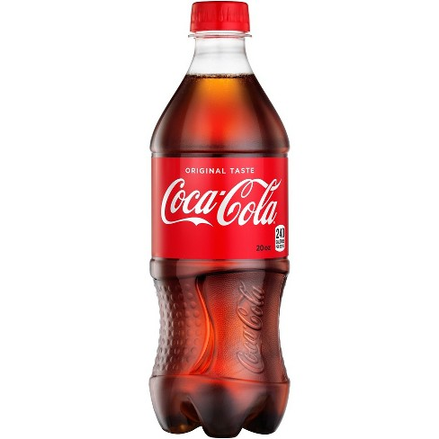

### Culture
SOC100: Introduction to Sociology  
Brian McPhail  
Purdue University
---

---

### Culture

- The values, norms, and material goods characteristic of a given group.

---
### Conflict Theory

- Cultural norms privilege certain values, ideas, attitudes, spaces and histories.

- **Question**: How would a social problem related to Coca-Cola be interpreted by a Conflict Theorist?

---
### Symbolic Interactionism

- Objects and actions are attached to particular symbolic meanings. Communication and language are key mediums in which objects and actions are interpreted and ultimately, responded to.  

- **Question**: How would meaning attached to Coca-Cola be interpreted by a Symbolic Interactionist?

---
